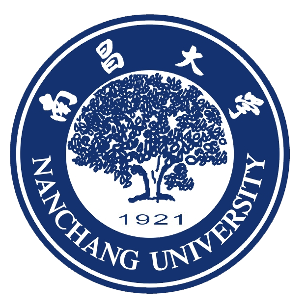
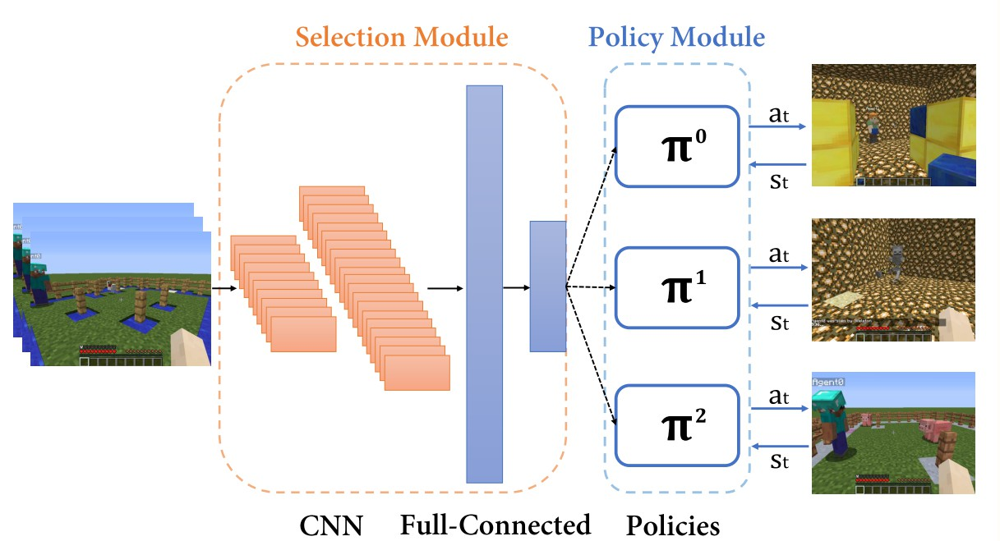

I will soon Join [Game AI Group](http://gameai.eecs.qmul.ac.uk/) at Queen Mary University of London as a PhD student working with Prof. Diego Perez.

Working on Reinforcement Learning and Multi-task Learning.

# Education
 **Nanchang University** : *Sep.2016~*Jun.2020*

B.E Software Engineering.  GPA: **3.0/4.0** (with a **3.6** in my first semester and after that I spent a long time figured out **where I am and where I wanna reach** in computer science world. )

# Experience
* **South University of Science and Technology** - *Oct. 2019* ~ *Jun.2019*

* Research Assistant at MEDIAN Group
    *  Multi-task learning with RL.

*  **WestLake University** - *Aug. 2019* ~ *Sept.2019*
    * Visiting Research Student at Robotic AI Group
    * Reinforcement Learning Agent for robot arm grasping in unstructred environment.

* **OPPO Corp.** - *Sept. 2018* ~ *Dec. 2018*
    * RDE, working on the first generation of OPPO's voice assistant.

# Publication
* 

* [**A Hierarchial Approach for MARLO Challenge**](https://ieeexplore.ieee.org/document/8847943)
    * Linjie Xu, Yihong Chen
    * We use a straightforward approach to sovle 3 collabrative tasks on [Minecraft](https://www.microsoft.com/en-us/research/blog/winners-announced-in-multi-agent-reinforcement-learning-challenge)

# Research Interest

* **Reinforcement Learning**: Practical algorithms and applications on robotics and game AI.

# Personal Interest

* **Badminton**: Recently started, enjoy singles more than doubles.
* **Chat**: Always enjoy chat and make any kinds of jokes.
* **Reading**: Recently *lone suvivers*. A maintained list of books will be released soon.